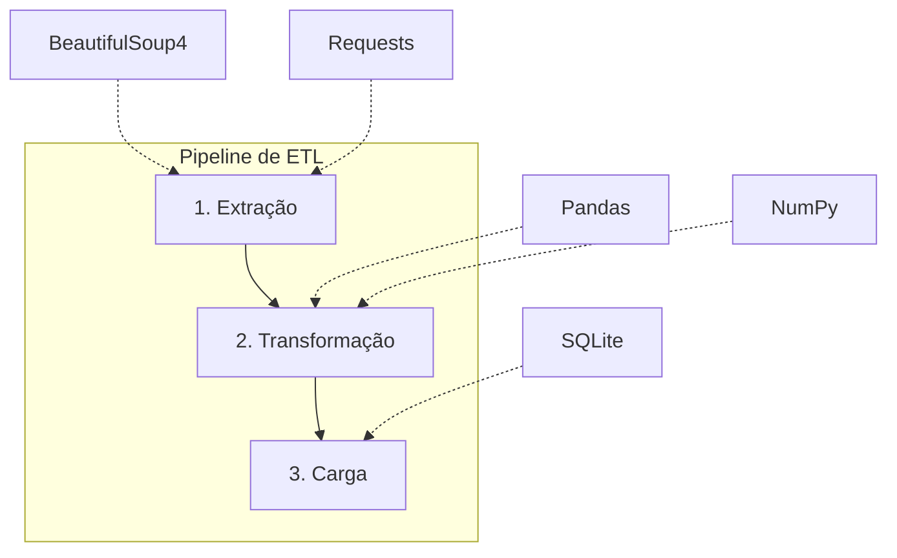

## 1. Introdução aos Dados Abertos e ETL

Recentemente, em busca de novos conjuntos de dados para análise, examinei diversas fontes públicas. Há excelentes portais de dados abertos que oferecem insumos valiosos para enriquecer qualquer estudo em Ciência de Dados e Estatística.

Dados abertos são informações disponibilizadas publicamente para livre acesso e reutilização. Contudo, é comum que se apresentem desestruturados ou organizados de forma não otimizada para coleta direta, surgindo assim o desafio de aplicar um processo de ETL (Extract, Transform, Load).

O acrônimo ETL refere-se às etapas de Extrair, Transformar e Carregar. Trata-se do fluxo responsável por integrar dados provenientes de múltiplas fontes para construir um repositório centralizado ou data warehouse. Como essa é uma rotina essencial no cotidiano da engenharia e análise de dados, dominar sua implementação é indispensável.

Neste artigo, abordaremos os dados abertos de acidentes de trânsito disponibilizados pela Polícia Rodoviária Federal (PRF). A instituição estruturou um sistema detalhado de registros públicos e disponibiliza um painel interativo com estatísticas sobre as ocorrências nas rodovias federais (BRs).

Vale ressaltar que a extração descrita possui finalidade estritamente didática para execução local. O cenário proposto enfrenta uma limitação prática: a PRF disponibiliza os dados em arquivos compactados (.zip) hospedados no Google Drive, segregados por ano e por tipo de informação (por ocorrência ou por pessoa).

O objetivo principal é automatizar o fluxo de coleta e estruturar um banco de dados relacional. Em vez de realizar o download manual de cada arquivo, utilizaremos Python para navegar pela página, mapear os links de download, baixar os arquivos compactados, descompactá-los em memória e consolidar a base final.

## 2. Arquitetura da Solução

Para garantir eficiência e rastreabilidade, uma pipeline de ETL deve ser construída com ferramentas adequadas a cada etapa do processo. A solução foi projetada para realizar requisições à página oficial da PRF e extrair as URLs de download armazenadas no Google Drive, combinando técnicas de web scraping e acesso a URLs públicas.



## 3. Implementação do Pipeline

Aqui é a parte que mais gosto, vamos colocar a mão na massa e implementar o pipeline de ETL para a ingestão dos dados abertos de acidentes de trânsito da PRF seguindo a arquitetura proposta. Faremos a extração de dados agrupados por pessoa, assim futuramente poderemos analisar o impacto de cada acidente nas pessoas envolvidas.

### 3.1. Extração em Streaming

Embora seja possível acessar a pasta do Google Drive diretamente, optar pelo parsing da página oficial é mais vantajoso, pois o portal organiza os dados em um catálogo estruturado por categorias e períodos, servindo como um menu centralizado de navegação.

Uma vez obtidos os links públicos, realizamos o download com a biblioteca `requests`. O tratamento de falhas na comunicação HTTP é assegurado pelo método `raise_for_status()`. Além disso, para lidar com arquivos volumosos sem comprometer a estabilidade, o download é feito em fluxo contínuo (chunks) com validação de cabeçalhos de integridade.

Como os dados são disponibilizados compactados, a extração dos arquivos CSV é feita inteiramente em memória via stream, utilizando os módulos nativos `zipfile` e `io`. Essa estratégia evita gravações intermediárias no disco rígido e previne o consumo excessivo de memória RAM.

```python

import io
import re
import zipfile
import requests
from bs4 import BeautifulSoup
import pandas as pd

URL_PAGINA_PRF = "https://www.gov.br/prf/pt-br/acesso-a-informacao/dados-abertos/dados-abertos-da-prf"
REGEX_DRIVE_ID = re.compile(r"/file/d/([^/?#]+)")

def mapear_links_acidentes(url_portal: str) -> dict[int, str]:
    """
    Realiza o web scraping na tabela do portal da PRF e identifica
    o ID de download do Google Drive para cada ano disponível.
    """
    resposta = requests.get(url_portal, timeout=30)
    resposta.raise_for_status()

    soup = BeautifulSoup(resposta.text, "html.parser")
    links_por_ano: dict[int, str] = {}

    for linha in soup.find_all("tr"):
        texto = linha.get_text(" ")
        tag_a = linha.find("a", href=REGEX_DRIVE_ID)

        # Filtra a série histórica de acidentes agrupados por pessoa
        if "Agrupados por pessoa" in texto and tag_a:
            match_ano = re.search(r"\b(20\d{2})\b", texto)
            match_id = REGEX_DRIVE_ID.search(tag_a["href"])
            
            if match_ano and match_id:
                ano = int(match_ano.group(1))
                file_id = match_id.group(1)
                links_por_ano[ano] = file_id

    return links_por_ano


def extrair_csv_em_memoria(file_id: str, chunksize: int = 100_000):
    """
    Baixa o arquivo compactado em streaming e itera sobre os chunks do CSV
    diretamente em memória (io.BytesIO), sem gravações intermediárias em disco.
    """
    url_download = f"https://drive.google.com/uc?export=download&id={file_id}"
    
    with requests.get(url_download, stream=True, timeout=60) as resp:
        resp.raise_for_status()

        # Buffer em memória para receber os bytes do arquivo compactado
        buffer_zip = io.BytesIO()
        for bloco in resp.iter_content(chunk_size=1024 * 1024):  # Chunks de 1MB
            if bloco:
                buffer_zip.write(bloco)
        
        buffer_zip.seek(0)

        # Abertura e descompactação do CSV em memória
        with zipfile.ZipFile(buffer_zip) as arquivo_zip:
            lista_csvs = [f for f in arquivo_zip.namelist() if f.lower().endswith(".csv")]
            if not lista_csvs:
                raise FileNotFoundError("Nenhum arquivo CSV localizado no ZIP.")

            # Leitura do stream em lotes (chunks) com o Pandas
            with arquivo_zip.open(lista_csvs[0]) as stream_csv:
                yield from pd.read_csv(
                    stream_csv,
                    sep=";",
                    encoding="cp1252",
                    dtype=str,
                    chunksize=chunksize,
                    keep_default_na=False
                )
```

Pode ocorrer de alguns arquivos no Google Drive possuírem um tamanho acima de 100MB, geralmente será lançado um alerta: "O Google Drive não pode verificar se este arquivo está livre de vírus". Nesse caso, não há risco de ocorrer pois os dados estão abaixo desse tamanho. No entanto, se for realizar a ingestão de arquivos maiores, pode ser necessária uma etapa a mais em seu pipeline para contornar o alerta de vírus.

### 3.2. Sanitização e Tipagem

A etapa de transformação é o ponto crítico do fluxo. Antes da persistência no banco de dados, é essencial sanitizar as variáveis, prevenindo divergências de tipagem, registros nulos indevidos ou inconsistências de encoding entre os arquivos de diferentes anos. A padronização rigorosa garante a confiabilidade de futuras consultas analíticas.

O processamento e a sanitização dos dados foram executados com as bibliotecas `pandas` para manipulação em lote de tipos, datas e valores ausentes e `numpy` para operações vetoriais e validações numéricas.

```python
import numpy as np
import pandas as pd

# Marcadores habituais de valores ausentes nos registros da PRF
MARCADORES_NULO = {"NA", "N/A", "(null)", ""}

def sanitizar_chunk(df_bruto: pd.DataFrame, ano_referencia: int) -> pd.DataFrame:
    """
    Padroniza e sanitiza um lote (chunk) de dados:
    - Normaliza representações de nulos para None.
    - Trata formato de datas no padrão ISO 8601 (YYYY-MM-DD).
    - Converte números decimais com vírgula para float.
    - Garante tipagem de inteiros seguros e adiciona a coluna de partição (ano).
    """
    df = df_bruto.copy()

    # 1. Padronização de valores ausentes
    df = df.replace(MARCADORES_NULO, None)

    # 2. Conversão da data do acidente (formato original: YYYY-MM-DD)
    if "data_inversa" in df.columns:
        df["data_inversa"] = pd.to_datetime(
            df["data_inversa"], format="%Y-%m-%d", errors="coerce"
        ).dt.strftime("%Y-%m-%d")

    # 3. Conversão de medidas com separador decimal brasileiro (vírgula -> ponto)
    colunas_decimais = ["km", "latitude", "longitude"]
    for col in colunas_decimais:
        if col in df.columns:
            valores_num = pd.to_numeric(
                df[col].astype(str).str.replace(",", ".", regex=False),
                errors="coerce"
            )
            # Converte valores infinitos ou inválidos para nulo
            df[col] = valores_num.where(np.isfinite(valores_num), None)

    # 4. Conversão de identificadores e métricas de vítimas para Inteiro
    colunas_inteiras = [
        "id", "pesid", "br", "idade", "mortos",
        "feridos_graves", "feridos_leves", "ilesos"
    ]
    for col in colunas_inteiras:
        if col in df.columns:
            df[col] = pd.to_numeric(df[col], errors="coerce").astype("Int64")

    # 5. Higienização de strings (remoção de espaços nas extremidades)
    colunas_texto = ["uf", "municipio", "causa_acidente", "tipo_acidente"]
    for col in colunas_texto:
        if col in df.columns:
            df[col] = df[col].astype(str).str.strip().replace("None", None)

    # 6. Inclusão da coluna de particionamento anual
    df["ano"] = ano_referencia

    return df
```

### 3.3. Carga Transacional e Idempotência

Com os dados higienizados em memória, avança-se para a etapa de carga. Para o armazenamento local, adotou-se o SQLite, um SGBD relacional leve, embutido e sem necessidade de servidor central. Por gerar um arquivo único, o SQLite é ideal para prototipagem rápida e facilita migrações futuras para bancos corporativos. Além disso, adicionamos índices nas colunas mais utilizadas em consultas para garantir uma melhor performance.

```python
import sqlite3
import pandas as pd

def inicializar_banco(caminho_db: str = "acidentes_prf.db") -> sqlite3.Connection:
    """Cria a conexão SQLite e estrutura as tabelas e índices se não existirem."""
    conn = sqlite3.connect(caminho_db)
    cursor = conn.cursor()

    cursor.execute("""
    CREATE TABLE IF NOT EXISTS acidentes (
        id INTEGER,
        pesid INTEGER,
        data_inversa TEXT,
        dia_semana TEXT,
        horario TEXT,
        uf TEXT,
        br INTEGER,
        km REAL,
        municipio TEXT,
        causa_acidente TEXT,
        tipo_acidente TEXT,
        classificacao_acidente TEXT,
        fase_dia TEXT,
        sentido_via TEXT,
        condicao_metereologica TEXT,
        tipo_pista TEXT,
        tracado_via TEXT,
        uso_solo TEXT,
        tipo_veiculo TEXT,
        marca TEXT,
        tipo_envolvido TEXT,
        estado_fisico TEXT,
        idade INTEGER,
        sexo TEXT,
        ilesos INTEGER,
        feridos_leves INTEGER,
        feridos_graves INTEGER,
        mortos INTEGER,
        latitude REAL,
        longitude REAL,
        regional TEXT,
        delegacia TEXT,
        uop TEXT,
        ano INTEGER NOT NULL
    );
    """)

    # Índices para acelerar consultas analíticas
    cursor.execute("CREATE INDEX IF NOT EXISTS idx_acidentes_ano ON acidentes (ano);")
    cursor.execute("CREATE INDEX IF NOT EXISTS idx_acidentes_uf ON acidentes (uf);")
    cursor.execute("CREATE INDEX IF NOT EXISTS idx_acidentes_data ON acidentes (data_inversa);")
    
    conn.commit()
    return conn


def carregar_dados_ano(conn: sqlite3.Connection, chunks_transformados, ano: int) -> int:
    """
    Insere os lotes higienizados garantindo atomicidade e idempotência:
    se o ano já existir, apaga os registros antigos antes de recarregar.
    """
    total_linhas = 0
    cursor = conn.cursor()

    try:
        # Início explícito da transação
        cursor.execute("BEGIN TRANSACTION;")

        # Garante idempotência da carga
        cursor.execute("DELETE FROM acidentes WHERE ano = ?;", (ano,))

        for chunk_df in chunks_transformados:
            chunk_df.to_sql(
                name="acidentes",
                con=conn,
                if_exists="append",
                index=False,
                chunksize=5000
            )
            total_linhas += len(chunk_df)

        conn.commit()
        return total_linhas

    except Exception as erro:
        conn.rollback()  # Rollback em caso de qualquer falha
        raise RuntimeError(f"Falha na carga do ano {ano}: {erro}") from erro
```

### 3.4. Governança e Orquestração

Para garantir a governança do processo, foi implementado um sistema de logging que registra todas as etapas da transação, além de capturar eventuais exceções. Sendo um fluxo automatizado, os logs consolidados servem como auditoria ao final da execução.

```python
import logging
import sqlite3
from datetime import datetime, timezone

# 1. Configuração do Logging no console e em arquivo local
logging.basicConfig(
    level=logging.INFO,
    format="%(asctime)s [%(levelname)s] %(message)s",
    handlers=[
        logging.StreamHandler(),
        logging.FileHandler("pipeline_etl.log", encoding="utf-8")
    ]
)
logger = logging.getLogger("ETL_PRF")

# 2. Registro em tabela de auditoria relacional
def registrar_log_auditoria(
    conn: sqlite3.Connection,
    ano: int,
    status: str,
    total_linhas: int | None = None,
    mensagem: str | None = None
) -> None:
    """Persiste o status de execução na tabela de controle 'etl_log'."""
    timestamp = datetime.now(timezone.utc).isoformat(timespec="seconds")
    
    with conn:
        conn.execute("""
            CREATE TABLE IF NOT EXISTS etl_log (
                ano INTEGER NOT NULL,
                status TEXT NOT NULL CHECK (status IN ('ok', 'pulado', 'erro')),
                linhas INTEGER,
                mensagem TEXT,
                timestamp TEXT NOT NULL
            );
        """)
        conn.execute("""
            INSERT INTO etl_log (ano, status, linhas, mensagem, timestamp)
            VALUES (?, ?, ?, ?, ?);
        """, (ano, status, total_linhas, mensagem, timestamp))

    if status == "ok":
        logger.info(f"Ano {ano} processado com sucesso: {total_linhas:,} linhas.")
    elif status == "pulado":
        logger.info(f"Ano {ano} inalterado. Carga pulada.")
    else:
        logger.error(f"Erro no processamento do ano {ano}: {mensagem}")


# 3. Orquestração com tratamento de exceções
def executar_etl_por_ano(conn: sqlite3.Connection, ano: int, file_id: str):
    logger.info(f"Iniciando pipeline ETL para o ano {ano}...")
    try:
        # Extração em streaming
        stream_chunks = extrair_csv_em_memoria(file_id)

        # Transformação aplicada via generator expression (lazy evaluation)
        chunks_limpos = (sanitizar_chunk(chunk, ano) for chunk in stream_chunks)

        # Carga transacional no banco
        linhas = carregar_dados_ano(conn, chunks_limpos, ano)

        # Auditoria de sucesso
        registrar_log_auditoria(conn, ano=ano, status="ok", total_linhas=linhas)

    except Exception as exc:
        logger.exception(f"Erro crítico no ano {ano}: {exc}")
        registrar_log_auditoria(conn, ano=ano, status="erro", mensagem=str(exc))
```

Com a base histórica (compreendendo o período de 2017 a 2026) devidamente consolidada no banco de dados, o próximo passo consistirá na análise exploratória para mapear trechos de maior ocorrência de sinistros e identificar os principais fatores associados. Os resultados serão publicados aqui em breve. O código completo do projeto está disponível no [GitHub](https://github.com/ebenezer-dorneles/etl-prf-data).
