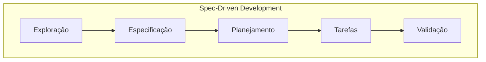

Perdi uma manhã inteira revisando o código que a IA tinha gerado. Não era código ruim — só não era nada do que eu precisava. Foi esse retrabalho que me fez repensar como trabalho com IA, e comecei a estudar e aplicar o **Spec-Driven Development (SDD)** no meu dia a dia.

SDD é uma metodologia em que especificações detalhadas e estruturadas são elaboradas antes da implementação, servindo como a fonte da verdade para o projeto que irá guiar todo o processo de construção do sistema. Por um lado, ele funciona como a materialização do nosso conhecimento sobre o sistema que queremos construir e, por outro lado, como uma forma de garantir que a IA esteja alinhada com o que esperamos.

Se você está se perguntando por que deveria testar o SDD, a resposta é simples: **a IA é uma ferramenta probabilística**. Ela infere respostas com base em um conjunto de informações. Se você entrega um prompt ruim ou mal planejado, abre margem para a IA decidir o que ela "acha" que deve ser feito. Você pede algo de forma superficial e ela entrega algo desalinhado.

A IA veio para revolucionar a forma como construímos sistemas. Porém, para não cairmos na armadilha do estilo "vibe coder" (aquele que só copia e cola, sem entender), precisamos aprender a usá-la como verdadeiros profissionais. Acredito que muitos desenvolvedores já fazem isso de forma intuitiva, mas aplicar o SDD de forma consciente faz toda a diferença. Por isso adotei essa filosofia de trabalho: um processo que vai muito além do prompt e foca no desenvolvimento profissional, do jeito que já estamos acostumados.

Esse profissionalismo também passa por gerenciar um recurso escasso no dia a dia com IA: **a janela de contexto** que nada mais é que um conjunto de informações (tokens) geradas em uma conversa com a IA, funcionando como a sua "memória" momentânea. Gerenciar isso é fundamental para que a IA não "esqueça" de partes importantes do projeto.

Dependendo do modelo e da tarefa, quanto mais cheia estiver a janela de contexto, menos precisa pode ser a resposta da IA. Então, aquela correção que você jurava que seria rápida acaba gerando idas e vindas desnecessárias, poluindo a conversa, seja por falta de planejamento ou entendimento superficial do problema por parte da IA.

O que me atraiu no SDD é a divisão clara de responsabilidades entre máquina e humano. Nós delegamos para a IA a escrita do código, mas os casos de uso, as regras de negócio, as ferramentas e as tecnologias continuam sendo nossas. É como se fosse uma via de mão dupla, em que a IA é responsável por implementar as soluções, enquanto nós somos responsáveis por definir o rumo do projeto.

Você pode até pensar: *"Ah, mas eu posso alinhar tudo isso com o meu time usando apenas prompts!"*. Mas aí entra o ponto central: **você documentou as decisões?** Quem definiu os casos de uso, os impactos e os cenários de borda? Foi a IA ou a equipe? Você consegue visualizar o que vai aplicar antes mesmo de ser construído? É importante documentar as decisões que precisam ser tomadas, pois elas servirão de referência para o projeto e permitirão revisitá-las quando necessário, muito semelhante a um diário de bordo, só que agora temos a IA para nos ajudar com isso.

Somos a mente por trás de uma ferramenta que acelera as entregas, mas velocidade não é sinônimo de qualidade. Saber especificar e planejar já era fundamental muito antes da IA, e esse fluxo agora se tornou ainda mais eficiente. Pensar no software continua sendo nosso papel; a IA acelera a execução, mas o resultado ainda precisa ser auditado por um humano. Além disso, com uma boa especificação, conseguimos estruturar testes automatizados e de qualidade para manter o projeto nos trilhos.

Em geral, utilizo SDD para tasks mais complexas. Para tarefas mais simples, como criar um README ou corrigir um bug, não vejo necessidade de aplicar essa metodologia. Para um bug fix de duas linhas, o custo de especificar supera o ganho.

## As 5 etapas do SDD

Para trabalharmos com o SDD, precisamos seguir uma série de etapas para garantir que o projeto seja bem definido e que a IA esteja alinhada com o que esperamos. Abaixo, listo as 5 etapas principais do processo de SDD que utilizo em meus projetos:



Para lidar com cada uma das etapas acima, criei templates que auxiliam na estruturação das informações e guiam a IA durante o processo. Eu indico criar skills para as etapas de planejamento, tarefas e validação, pois em geral é fluxo repetitivo e que se beneficia da padronização. As etapas de especificação e exploração variam muito de projeto para projeto.

### 1. Exploração

Antes de sair querendo construir o "Instagram 2.0", você precisa entender o escopo. Na empolgação do momento, podemos gastar muitos tokens desnecessários. Explorar os casos de uso logo no início é uma excelente salvaguarda. Entre com o cenário para que a IA gere um documento norteador para sua especificação. Por exemplo:

```md

# PAPEL
Você é um Engenheiro de Requisitos especialista em Product Discovery.

# CONTEXTO
Tenho um sistema de notas de estudo em arquivos Markdown (.md) locais e estou adicionando imagens e PDFs anexos. Preciso de uma solução para organizar esse acervo e buscar por palavras-chave em disco.

# INSTRUÇÕES
1. Foque exclusivamente no problema, necessidades e comportamentos esperados.
2. NÃO sugira linguagens, bibliotecas, frameworks ou bancos de dados neste momento.
3. Se houver ambiguidades críticas sobre o fluxo, aponte-as como perguntas bloqueantes.

# ESTRUTURA DE RESPOSTA
## 1. Declaração do Problema e Metas
## 2. Personas e Cenários de Uso Principais
## 3. Requisitos Funcionais (O que o sistema deve fazer)
## 4. Requisitos Não-Funcionais (Restrições de performance, privacidade local, formatos)
## 5. Perguntas em Aberto (Dúvidas que precisam de resposta antes da especificação)

```

A exploração nasce de uma ideia ou necessidade, e a IA nos ajuda a entender o escopo do projeto e a definir os casos de uso que precisam ser desenvolvidos. O resultado desse processo é um documento que será utilizado nas próximas etapas, por isso é importante que ele seja bem estruturado e detalhado; não foque em tecnologias ou frameworks. Foque nos problemas que precisam ser resolvidos e pense em perguntas como:

- Qual o objetivo do projeto?
- Quem são os usuários?
- Quais são os casos de uso?
- Quais são os requisitos não-funcionais?

### 2. Especificação

Aqui a ideia já está madura. É o momento de mapear as nuances fundamentais para a resolução do problema, lidando com os casos de uso e possíveis impactos. É o momento de lapidar o projeto, definindo personas, jornadas de usuário, arquitetura inicial (entregável), entre outros. É importante documentar esse fluxo de estados da solução encontrada na exploração.

```md
# PAPEL
Você é um Arquiteto de Software responsável por fechar a especificação funcional.

# ENTRADA
Considere o documento de exploração: [caminho/do/discovery.md]

# INSTRUÇÕES
Transforme os achados do documento de exploração em uma especificação técnica formal e inequívoca, pronta para ser implementada e testada.

# ESTRUTURA DE RESPOSTA
## 1. Casos de Uso (com Pré-condições, Fluxo Principal e Fluxos de Exceção)
## 2. Regras de Negócio e Invariantes
## 3. Critérios de Aceite (Formato Given / When / Then)
## 4. Decisões Tomadas (ADRs sintéticas justificando o escopo mantido ou descartado)
## 5. Riscos e Dependências Externas
```

### 3. Planejamento

É onde definimos tecnologias, paradigmas e arquitetura. Com a especificação pronta e a stack definida, usamos a ajuda da IA para decompor o projeto em etapas. Para a arquitetura, gosto de criar um diagrama *Mermaid* para visualizar o fluxo. No planejamento, também já instruo a IA a seguir a filosofia do TDD (*Test-Driven Development*), garantindo cobertura de testes para as tarefas que virão a seguir.

```md
# PAPEL
Você é um Tech Lead definindo a arquitetura e a estratégia de entrega.

# ENTRADA
Considere a especificação funcional: [caminho/do/spec.md]

# INSTRUÇÕES
1. Proponha uma arquitetura enxuta, desacoplada e testável, orientada a TDD.
2. Defina a stack justificando cada escolha técnica contra os requisitos não-funcionais.
3. Inclua um diagrama visual em sintaxe Mermaid descrevendo o fluxo de dados e os módulos.

# ESTRUTURA DE RESPOSTA
## 1. Stack e Ferramentas (Linguagem, runtime, suíte de testes e justificativas)
## 2. Arquitetura da Solução (Módulos, boundaries e diagrama Mermaid)
## 3. Estratégia de Testes (Unitários, integração e mock de arquivos locais)
## 4. Fases de Implementação (Roadmap sequencial de marcos entregáveis)
```

### 4. Tarefas

É a hora de botar a IA para trabalhar de verdade. Com a especificação documentada e o planejamento pronto, instruímos a IA a seguir o roteiro e criar as tarefas da primeira fase. Gosto de executar por etapas e, a cada entrega, pedir para a IA atualizar os registros e compactar o que foi feito na sessão. Assim, posso pausar e retomar as minhas tarefas depois sem o risco de perder o contexto da conversa.

```md
# PAPEL
Você é um desenvolvedor sênior organizando a fila de execução da Fase 1.

# ENTRADA
Considere o plano de arquitetura: [caminho/do/plan.md]

# INSTRUÇÕES
1. Quebre exclusivamente a **Fase 1** em tarefas atômicas e sequenciais.
2. Cada tarefa deve aplicar o ciclo TDD: definir o teste primeiro (Red), o código mínimo para passar (Green) e a refatoração.
3. As tarefas não devem ultrapassar uma única responsabilidade por item.

# ESTRUTURA DE RESPOSTA
Para cada tarefa, utilize o modelo:

### [TASK-XX] Título da Tarefa
* **Objetivo:** O que será construído.
* **Arquivos Afetados:** Caminho dos arquivos de teste e de código.
* **Ciclo TDD:**
  1. *Red:* Teste unitário/integrado a ser escrito.
  2. *Green:* Implementação mínima necessária.
  3. *Refactor:* Critérios de limpeza e padronização.
* **Critério de Conclusão (Definition of Done):** Condição para marcar como concluída e passar para a próxima.
```

### 5. Validação

É o encerramento do ciclo, mas não necessariamente do projeto. É a hora de validar se tudo o que foi especificado e planejado foi realmente entregue. Se cada etapa seguiu o padrão de saída, com as instruções definidas na especificação, o processo de validação se torna muito mais simples. Envolve suíte de testes, cobertura de código, revisão de código, análise de performance, etc. Isso pode ser orquestrado pelas próprias IAs, desde que elas tenham as ferramentas necessárias para isso.

```md
# PAPEL
Você é um revisor de conformidade técnica e QA.

# ENTRADAS
- Especificação Original: [caminho/do/spec.md]
- Plano e Tarefas Realizadas: [caminho/do/tasks.md]
- Relatório de Testes / Código Entregue: [caminho/do/resumo_ou_diff]

# INSTRUÇÕES
1. Valide a conformidade da entrega contra a especificação inicial e os critérios de aceite.
2. Aponte se houve escopo esquecido, casos de borda sem cobertura ou código além do necessário.

# ESTRUTURA DE RESPOSTA
## 1. Matriz de Rastreabilidade (Caso de Uso original vs. Teste implementado vs. Status)
## 2. Gaps e Inconsistências (O que faltou ou divergiu da spec)
## 3. Resumo de Qualidade (Cobertura dos cenários de borda e robustez)
## 4. Veredito da Fase (Aprovado / Requer Ajustes)
```

## Organização

É importante que se adote um template para os documentos gerados pela IA, para que todas as etapas seguintes sigam o mesmo padrão de saída, o que torna as entregas previsíveis e consistentes. Existem alguns frameworks para isso como o [Spec Kit](https://github.com/github/spec-kit) e o [OpenSpec](https://github.com/Fission-AI/openspec).

Em minha rotina eu adotei meus próprios templates baseados em SDD, e eles têm me ajudado muito a manter o controle do escopo, do contexto e das tarefas. Isso também me dá maior clareza sobre como o projeto está se desenvolvendo. Estou usando há algum tempo e gostei muito de como ele funcionou para mim, sem a necessidade de ficar trocando centenas de prompts com a IA. Além disso, toda a metodologia de decisão fica registrada e versionada no repositório.

```md

.workspace/docs/

└── specs/

└── <specification_name>

├── explore/ # Documentos iniciais para entender o escopo

│ └── <feature>.md # Documentos de exploração do projeto

├── spec.md # Documento de especificação do projeto

├── plan.md # Planejamento do projeto

├── task_plan.md # Tarefas geradas pela IA a partir da especificação

└── validate.md # Validação do projeto
```

Isso é útil para ter um registro histórico do projeto e garantir que a IA esteja alinhada com o que esperamos. Também permite que qualquer pessoa da equipe entenda o contexto do projeto sem precisar ler centenas de mensagens de chat ou analisar linhas de código. Todas as etapas seguem o mesmo padrão de saída, o que facilita o entendimento do fluxo de trabalho.

## Desafios do SDD

Apesar dos benefícios, o SDD não é uma solução mágica e enfrenta desafios práticos que precisam ser gerenciados:

* **Dependência da qualidade das especificações:** A precisão da especificação impacta diretamente na qualidade da implementação. Erros ou omissões na especificação podem levar a implementações incorretas ou incompletas. É essencial revisar e validar as especificações antes de prosseguir para a implementação.

* **Curva de aprendizado:** A adoção do SDD requer uma mudança de mentalidade e novas habilidades por parte dos desenvolvedores. É necessário aprender a criar especificações claras e detalhadas, bem como a gerenciar o processo de validação. O treinamento da equipe é fundamental para garantir uma transição suave e bem-sucedida.

* **Complexidade em projetos pequenos:** O SDD pode ser overkill para projetos pequenos ou tarefas simples. A criação de especificações detalhadas pode consumir mais tempo do que a implementação em si. É importante avaliar se o SDD é realmente necessário para o projeto em questão.

E no seu dia a dia, como você mantém o controle de contexto com IA? Já experimentou versionar especificações antes do código?